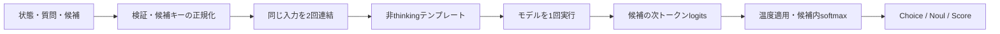

> Public-release clarification: “manual”, “handwritten”, “手書き”, and “independent reviewer” in these historical records refer to individual writing/review by separate AI agents, not human expert annotation or external independent evaluation. See [DATA_CARD.md](DATA_CARD.md) for scope and provenance.

# Mini Jev の判断経路

日本語の状態・質問・候補を、固定したローカル言語モデルの候補スコアへ変換します。
Qwen3.6-35B-A3BのQ4_K_M量子化モデルをllama.cpp/Metalで常駐させます。
本家Jevの内部構造を再現したものではなく、Choice・Noul・Scoreを返す独立実装です。

Choice・Noulと11段階以上のScoreは、候補をA〜Zの単一トークンへ対応させます。10段階以下のScoreは0〜9の数字を直接候補にし、固定したJSONの回答欄の直後のlogitsを読みます。毎回、候補が単独で1トークンであることと、実際の入力末尾へ追加しても既存トークンを変えずに1トークンだけ増えることを検証します。
トークンのサンプリングや文章生成は行いません。生成トークン数は0です。
現在のC++実装は全語彙の出力層を計算し、必要な候補のlogitsを取り出します。出力層の選択行だけを計算する最適化は採用していません。

| 型 | 返す値 | 意味 |
|---|---|---|
| Choice | choice、label、probabilities | 候補内で最大確率の意味キーと候補ごとの確率 |
| Noul | noul、label、probabilities | true候補の確率と最尤true/false |
| Score | score、label、legend、probabilities | 0始まり段階の期待値と最尤段階。scoreは小数になり得る |

候補確率は `p_i = softmax(logit_i / temperature)`、Scoreは `sum(i * p_i)` です。
confidenceは `1 - entropy(p) / log(候補数)`。候補内の分布の集中度であり、正解する確率ではありません。
校正用データで求めた温度を適用しても、未知の業務での確率の正しさを保証しません。
APIの `calibrated` と `calibration_generalization_validated` はfalseのままです。`temperature_calibration_applied` は温度を実際に読み込んだかを表します。

Choice辞書の挿入順はソートして正規化します。逆順試験での一致は、この正規化を含むサービスとしての性質です。
Noulはfalse、trueの順、Scoreは利用者が指定した段階順を維持します。質問IDはモデル入力へ含めません。

1つのHTTPリクエストに複数質問を指定できます。質問ごとにKV・再帰状態を消去して独立に逐次実行します。
stateの共有prefill、質問を並列に処理するネイティブバッチ、回答キャッシュはありません。
HTTPの遅延はリクエスト全体です。複数質問の時間を質問数で割った値を、単問応答時間として提示しません。

速度試験は常駐モデルへの実際の推論を測定します。入力トークン数にはテンプレートと繰り返した入力の両方を含めます。
512トークン以下の結果と、それを超える結果を分けて記録します。2,048トークンを超える入力は切り詰めず拒否します。
`llama_decode`の呼び出しは1問1回ですが、GPU内部のカーネル数が1という意味ではありません。

モデル本体の重みは凍結しています。以前の小型モデルでの出力ヘッド追加学習は、独立テストで精度を下げたため採用していません。
履歴と失敗結果は [README_EXPERIMENTS.md](README_EXPERIMENTS.md)、[HEAD_TUNING.md](HEAD_TUNING.md)、[旧4B試験](results/release-acceptance/REPORT.md) に残しています。

参考: [Jev API](https://docs.typesafe.ai/api)、[Qwen公式モデル](https://huggingface.co/Qwen/Qwen3.6-35B-A3B)、[固定GGUF](https://huggingface.co/ggml-org/Qwen3.6-35B-A3B-GGUF/tree/baec3ebee244827cda0f4557eafa8b28f7545fa6)。
