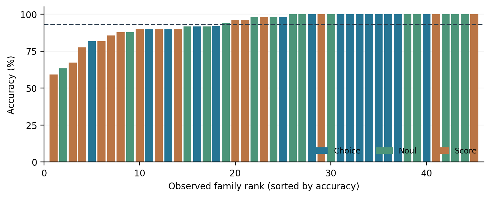
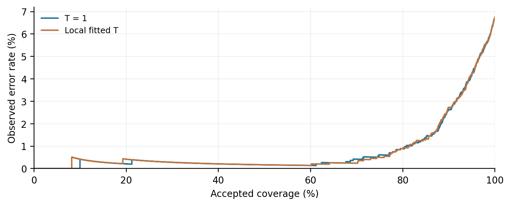

# Typed Decisions from Frozen Language Models: Readout, Calibration, and Transfer

**Yuki Oshio**

Working paper v0.1 | September 20, 2026 | Not peer reviewed or submitted

Code and data: [UpHash-Network/mini-jev](https://github.com/UpHash-Network/mini-jev)

## Abstract

Applications often require a categorical decision or an ordered score rather than generated prose. We study a reproducible local implementation that turns selected next-token logits of a frozen language model into typed responses. The evaluated system uses quantized Qwen3.6-35B-A3B, explicit single-token label checks, repeated task input, and deterministic response construction. On 2,400 self-authored Japanese questions it obtains 93.25% top-label accuracy; warm engine latency has a 379.1 ms 95th percentile for the 2,291 complete inputs of at most 512 tokens. These measurements are not evidence of a speed advantage over constrained generation. We derive the exact distributional equivalence to single-token masked decoding under matched conditions and examine the distinction between output validity and semantic correctness. A retrospective family-level analysis exposes substantial task heterogeneity. A separately specified, class-balanced 300-item JNLI public-development pilot obtains 81.0% accuracy without result-guided prompt tuning; contradiction recall is 61%. Temperature scaling produces small in-suite probability-loss changes but worsens ordinal expectation error, while an earlier residual-head experiment lowers accuracy. The contribution is an auditable empirical artifact and a set of qualified observations about using language models as decision functions; no new classification objective or replication of Jev's training method is claimed.

## 1. Introduction

A workflow may need to choose a route, evaluate a condition, or assign an ordered stage. Generating a sentence and parsing it is one implementation, but it is not necessary when the possible answers are known. A language model's next-token scores can instead be mapped to a finite candidate set and converted into typed values by ordinary software. This design makes response construction inspectable, while leaving the central semantic problem intact: the model may confidently select the wrong candidate.

We investigate this design in Mini Jev, a local, source-available implementation inspired by the public Choice, Noul, and Score interface of TypeSafe Jev [10]. The inspiration is an interface, not an architectural reproduction. We do not implement Jev's reported reinforcement-learning method, shared-state question processing, or proprietary model. We do not compare against Jev's service. The project's initial hypothesis was that a small output-stage update might improve a frozen model's decisions. An early experiment did not support that hypothesis, and the final evaluated configuration uses an unchanged backbone and vocabulary projection.

This paper asks three narrower questions. First, what quality and operational behavior does an explicit candidate-logit interface exhibit on a disclosed local suite? Second, how do temperature scaling and a small residual head affect different decision metrics? Third, how does the frozen interface transfer to an externally authored Japanese inference task? A separate systems comparison against generation remains necessary before making relative speed claims.

Our contributions are (1) a released implementation with token-boundary validation, deterministic typed outputs, model and runtime provenance, and reproducible prediction records; (2) a transparent evaluation distinguishing template-correlated regression performance from external transfer; and (3) probability and negative training results that constrain stronger interpretations. The basic readout is established practice. The equivalence argument below explains why comparing it with matched single-token constrained decoding cannot, by itself, demonstrate a new predictive method.

## 2. Related work

Prompt-based classification maps task classes to language-model label tokens. Pattern-exploiting training uses patterns and verbalizers for few-shot classification and natural-language inference [1]. Qwen's official reranker implementation is an especially direct precedent: it extracts final-position yes/no logits and normalizes the pair [2]. Our work applies this established readout idea to a local API with categorical, binary, and ordinal return types, with a different evaluation and runtime. It does not reproduce the reranker's task-specific training.

Grammar-constrained decoding restricts language-model outputs to valid structures [3]. A single permitted token is a special case. Under the assumptions in Section 3, masking other vocabulary entries yields exactly our candidate distribution. More complex grammars and multi-token answers have additional prefix-dependent behavior; the equivalence does not extend automatically to entire JSON sequences. Software construction guarantees a response schema without establishing that its selected semantic value is correct.

Prompt format and verbalizers can introduce biases. Contextual calibration studies prompt-induced label preferences [4], while work on multiple-choice selection bias documents sensitivity to option positions [5]. Mini Jev sorts Choice keys to make dictionary insertion order irrelevant. This is a software property; it neither removes model position bias nor proves robustness to renaming semantic keys. Prompt repetition is also prior work [6]. Our implementation repeats task content and incurs the resulting input-token cost.

Temperature scaling is a standard post-processing method for probability calibration [7]. A scalar temperature preserves the argmax but changes confidence and expected ordinal values. We therefore report several metrics rather than using an improvement in negative log likelihood (NLL) as a synonym for improved decisions. We use JGLUE's JNLI task for an external transfer pilot [8]. It is public development data, so its role here is external authorship, not an assertion that the pretrained model has never encountered it.

## 3. Typed readout and its relation to generation

### 3.1 Definition

A question contains state s, instructions q, and K candidate meanings, with 2 <= K <= 26. A deterministic formatter produces input x and associates each candidate i = 0, ..., K-1 with token t_i; all t_i are distinct token IDs. Let z_i denote the model's logit for t_i at the last input position. At temperature T > 0, the candidate probability is

```text
p_i = exp(z_i / T) / sum_j exp(z_j / T).
Choice = semantic_key(argmax_i p_i)
Noul = p_true
Score = sum_i i * p_i
```

Choice keys are sorted before rendering. Noul candidates are false and true, in that order. Score uses the supplied stage order; the expected value treats adjacent stage indices as equally spaced. The API does not infer a utility scale from stage descriptions. The reported entropy score is 1 - H(p)/log(K), which measures concentration within the candidate set, not the probability that the answer is correct.

The evaluated formatter repeats the task content twice. Choice and Noul use letter labels. Score uses digits for at most ten stages after a fixed assistant prefix, and letters for larger sets. Each label must be one token both alone and when appended to the actual prefix. Invalid boundaries cause rejection. This prevents an apparent one-token classification from silently becoming a multi-token scoring problem.

### 3.2 Equivalence under matched conditions

Consider a generator with the same model state, input prefix, candidate-token mapping, logits, and positive temperature. Suppose it sets every non-candidate logit to negative infinity and performs no other score transformation. Its next-token softmax is

```text
P(token = t_i | x, token in candidate set)
    = exp(z_i / T) / sum_j exp(z_j / T) = p_i.
```

This identity holds in real arithmetic; implementations may differ within floating-point tolerance. It follows directly because excluded tokens contribute zero to the softmax denominator. Greedy selection yields the same label if both implementations apply the same tie-breaking rule. Sampling yields the same distribution, rather than necessarily the same realized sample. Repetition penalties, top-k or top-p filtering, different templates, additional grammar state, and multi-token labels violate the stated conditions unless matched explicitly.

This identity is an explanatory property, not a novel theorem. A constrained generator that returns a label immediately after sampling need not run an additional model forward pass. Therefore, avoiding an autoregressive answer loop does not imply a large advantage over a one-token baseline. It can avoid the generation of a longer structured answer, but that possible benefit needs a measured, matched comparison.

### 3.3 Runtime and probability semantics

The native helper computes the full vocabulary projection and gathers selected logits. It does not compute only selected output rows. One llama_decode API call processes each question; this describes API accounting, not GPU kernel count or constant computation. The runtime resets model state between questions. Requests containing several questions are evaluated sequentially, with no shared prefill or answer cache. Complete inputs above 2,048 tokens are rejected rather than truncated.

The application constructs a JSON response from validated numeric values. Output construction and input validation can enforce schema and range constraints, but they do not enforce semantic correctness. Nor does candidate normalization measure how much unrestricted vocabulary probability supports the response format. An existing numerical fixture assigned roughly 0.01% of unrestricted vocabulary mass to the selected Score digits even though their renormalized probabilities summed to one. The entropy field and candidate probabilities should consequently not be treated as out-of-domain correctness guarantees.

## 4. Experimental material and provenance

### 4.1 Frozen local configuration

The main configuration uses Qwen3.6-35B-A3B in GGUF Q4_K_M form, with 35 billion total and 3 billion active parameters as described by its publisher [9]. Its weights are unchanged. The 20,419,565,568-byte model file, runtime source revision, six-thread setting, tokenizer behavior, prompt code, and manifests are recorded in the repository. The historical evaluation used llama.cpp revision f072b103714dfa1eee531f80b24512faf38e3dd2, Metal and Accelerate, ARM64 Python 3.10.5, and an Apple M5 Pro with 64 GB on macOS 26.4. All 41 layers were offloaded to the GPU.

The original run's fingerprint binds code, model bytes, helper and library files, aliases, configuration, and software environment. Public release logs redact local paths; redacted copies are not claimed to match every historical byte hash. A fresh build can produce different binary bytes and must be measured as a new runtime. The external pilot records its own fingerprint rather than inheriting the historical latency claim.

### 4.2 Local Japanese suite

The final local suite contains 800 Choice, 800 Noul, and 800 Score items. Of 2,400 total questions, 2,220 come from 45 generation families and 180 were individually authored by AI agents. The legacy label "manual" denotes these individually authored items, not human annotation. AI agents also reviewed the data. There is no independent human validation of this suite.

A separate 120-item split selected temperature by NLL. An earlier v1 suite had already been evaluated and used for development; the v2 author had diagnosed its first 400 predictions. The final v2 suite has no exact input overlap with v1 according to the recorded audit, but shares intended task skills and candidate-count distributions. It is thus an item-level held-out suite within a development process, not an external or family-disjoint benchmark. Since release, it should be treated as a public regression suite.

The final model, formatter, data, and calibration were frozen before the historical v2 evaluation. The run made 3,207 actual decode calls: 2,400 originals, 800 reversed Choice maps, and seven warm-ups. The reversed maps are consistency checks on the same questions, not additional independent quality examples. Likewise, 434 numerical checks on eight fixtures and service unit tests do not enlarge the semantic evaluation sample.

### 4.3 External JNLI pilot

JNLI, part of JGLUE, assigns entailment, contradiction, or neutral labels to Japanese sentence pairs [8]. We add a class-balanced 300-item pilot from its public development split. The preparation records the upstream revision, file hash, deterministic selection, instruction text, label mapping, temperature settings, and runtime configuration before inference. Each class contributes 100 items selected by a deterministic hash ranking. No pilot result is used to change the prompt, choose a temperature, or train a head.

The primary condition uses T=1. A secondary transfer condition applies the historical local-suite temperature without fitting on JNLI. Both conditions use the same stored logits, so their argmax accuracy is identical. The external data tests Choice with three labels; it does not validate Noul, Score, other candidate counts, or a full production domain. The balanced sample also does not preserve the dev set's natural label prevalence. Public benchmark contamination in pretraining is unknown.

Original dataset text is downloaded into a local work directory rather than redistributed in this paper's repository. The release records source attribution, IDs, input hashes, prediction records, scripts, and the applicable upstream license. Public dev data and before-inference local manifests should not be described as private held-out data or an independently registered study.

### 4.4 Metrics and retrospective analysis

Accuracy compares the highest-probability candidate with the gold label. Score accuracy is stage-label accuracy, not rounded expectation accuracy. Score mean absolute error (MAE) compares the continuous expected stage with the gold stage. We report NLL, multiclass Brier score (sum across classes), and ten equal-width-bin expected calibration error (ECE).

The family-aware reanalysis was designed after publication of the local-suite outcomes and is explicitly retrospective. Generated-family macro accuracy gives equal weight to each of the 45 observed families. Resampling entire families preserves within-family dependence. The individually AI-authored source is analyzed separately and grouped by its recorded tags when included in a stratified descriptive analysis. Bootstrap intervals quantify sensitivity to reweighting observed groups; they are not confidence guarantees for unobserved domains. Paired temperature comparisons reuse the same sampled groups for both temperatures. No test-set confidence threshold is selected for deployment.

## 5. Results

### 5.1 Local accuracy and task heterogeneity

| Type or source | Correct / total | Accuracy |
|---|---:|---:|
| Overall | 2,238 / 2,400 | 93.25% |
| Choice | 768 / 800 | 96.00% |
| Noul | 762 / 800 | 95.25% |
| Score | 708 / 800 | 88.50% |
| Template generated | 2,066 / 2,220 | 93.06% |
| Individually AI-authored | 172 / 180 | 95.56% |

All original responses passed the checked type, finiteness, normalization, and range constraints. The 162 semantic mistakes demonstrate why that property must be reported separately from accuracy. All 800 reversed Choice dictionaries returned the same semantic label, as expected from canonical sorting. This checks deterministic input handling, not model invariance to displayed option order.

Generated-family macro accuracy is 93.02%. The aggregate conceals weaker families: delay from a promised time scores 29/49, conditional obligation 31/49, counts after cancellation 33/49, and weighted items 38/49. The individually authored arithmetic subset scores 10/17. These observations restrict claims about general rule following and arithmetic.

Across 20,000 whole-family bootstrap replicates (fixed seed 2026092037), generated-family macro accuracy has a conditional 95% percentile interval of 89.91-95.74%. This interval describes reweighting the 45 observed families, not coverage for a new deployment population. The draws are not stratified by decision type, so the type mixture can vary. The wider range than an item-IID calculation would suggest is consistent with the observed heterogeneity.



### 5.2 Temperature scaling is metric dependent

The separate local calibration split selected T=1.3489628825916533. Positive scalar temperature preserves top-label accuracy. Its effect on other metrics is mixed:

| Metric, lower is better | T=1 | Fitted T |
|---|---:|---:|
| NLL | 0.188423 | 0.187871 |
| Multiclass Brier | 0.097261 | 0.096260 |
| ECE, 10 equal-width bins | 0.014863 | 0.015198 |
| Score expectation MAE | 0.169401 | 0.195121 |
| Score MAE / (K-1) | 0.044948 | 0.051964 |

The fitted temperature improves NLL and Brier slightly while worsening ECE and expected-stage MAE. NLL-optimal scaling need not minimize an ordinal decision loss. Calibration on a small synthetic split is also not evidence of probability calibration on another domain. The API marks whether temperature scaling was applied without asserting universal calibration.

Paired whole-cluster resampling uses 45 generated families and 26 individually authored tags, independently within each source. Within-source estimates are item weighted; the original source mix remains fixed at 2,220:180 for NLL and Brier and 740:60 for Score MAE. For the fitted-temperature minus T=1 difference, the conditional 95% intervals are -0.010705 to +0.008315 for NLL and -0.005021 to +0.002176 for Brier. Both span zero. The corresponding Score MAE difference is +0.025721, with interval +0.018260 to +0.033734. These intervals hold the fitted temperature fixed and omit uncertainty from calibration fitting and model selection.

Ranking local items by fitted maximum candidate probability gives an observed error rate of 17/1,920 (0.89%) at 80% coverage, compared with 162/2,400 (6.75%) when accepting every item. This is a retrospective descriptive curve, not a fitted or validated abstention policy. Two incorrect Score predictions have maximum candidate probability above 0.997, illustrating that high concentration does not prevent mistakes. No operational threshold is recommended from these results.



### 5.3 External transfer

The frozen zero-shot interface correctly classifies 243/300 selected JNLI items (81.0%), with macro F1 0.8101. The result is a class-balanced pilot, not a full-dev leaderboard score. Each class has 100 examples:

| Gold class | Predicted contradiction | Predicted entailment | Predicted neutral |
|---|---:|---:|---:|
| Contradiction | 61 | 1 | 38 |
| Entailment | 1 | 87 | 12 |
| Neutral | 1 | 4 | 95 |

Contradiction recall is 61%, entailment recall 87%, and neutral recall 95%. The system predicts neutral for 38 of 100 contradiction examples; its neutral precision is 65.52%. These outcomes identify a weakness in this fixed task setup, without isolating whether its cause is the backbone, prompt, label mapping, or benchmark conventions.

| JNLI probability metric | T=1 | Historical local T |
|---|---:|---:|
| NLL | 0.548088 | 0.461370 |
| Multiclass Brier | 0.291734 | 0.271941 |
| ECE, 10 equal-width bins | 0.129978 | 0.098614 |

Applying the pre-existing local temperature improves all three descriptive probability metrics on this pilot, with unchanged labels. Unlike the local Score result, this experiment has no ordinal expectation target. It shows transfer of this fixed transformation on one task, not universal calibration or an independently powered improvement claim.

All 300 selected pairs are distinct. An audit finds that 77 items share at least one sentence with a different selected item; there may also be image-origin dependence. We therefore give no IID binomial interval. A historical overlap counter in the frozen run counted 84 rows by including within-row duplicate sentences; a separate audit preserves that original record and corrects the cross-row definition. None of the predictions or performance metrics changes.

All complete inputs contain 406-476 tokens. Warm single-question wall-clock latency is 297.0 ms at p50 and 379.7 ms at p95 after three synthetic warm-ups. Startup is measured separately at 9.97 seconds. The complete run makes 303 decode calls. The raw dataset file is pinned at upstream commit 6f071c09316baae89c3d083a90985b4b1cb9968c. Prompt, sample, and both temperatures were locally frozen before inference; no result-guided revision was made.

The 81.0% external result and 93.25% local result are from different task distributions, label counts, and sampling schemes. Their difference is not an estimate of a controlled domain-shift effect, and we do not pool the datasets into an overall score.

### 5.4 Latency and operational scope

| Complete input length | Items | Warm p50 | Warm p95 | Maximum |
|---|---:|---:|---:|---:|
| At most 512 tokens | 2,291 | 282.7 ms | 379.1 ms | 423.4 ms |
| Above 512 tokens | 109 | 441.9 ms | 521.8 ms | 566.6 ms |

These historical timings measure a real warm single-question engine call, including complete input content and repetition. They are not cached-feature timings or end-to-end HTTP measurements. The 512-token subset is not the full suite. A separate integration check measured roughly 9.18 seconds for startup including integrity checks with OS file cache already warm, and approximately 579-582 ms for a three-question HTTP request. The latter is a whole-request observation and is not divided by three to claim single-request latency.

There is no matched generation baseline, repeated-device study, or throughput comparison. In particular, the distributional identity in Section 3 neither proves equal implementation overhead nor a speed advantage. The next systems experiment must hold model, quantization, input template, candidate semantics, cache policy, and timing boundaries fixed.

### 5.5 An earlier residual-head negative result

An earlier experiment used frozen Qwen2.5-1.5B-Instruct and a residual linear correction to six candidate logits. The correction adds a matrix applied to an RMS-normalized hidden state plus a bias, for 9,222 trainable parameters. A bias-only condition has six parameters. Neither head is used by the final 35B configuration.

| Small-model condition | Test correct / total | Accuracy |
|---|---:|---:|
| Frozen baseline | 73 / 96 | 76.04% |
| Residual linear head | 67 / 96 | 69.79% |
| Bias only | 74 / 96 | 77.08% |

Training used 768 synthetic rows and 256 reversed Choice variants, followed by distinct development and calibration splits of 192 rows each and 96 newly AI-authored test rows. Augmentation made Choice half of training examples while development and test were balanced across types. Scenario groups were separated, but generation templates were shared. Development NLL selected the head; calibration used a separate split.

The residual head reduced accuracy by six items despite improving some probability losses. The one-item bias-only gain is too small and the design too limited to support a general improvement claim. This single deterministic experiment is not a multi-seed training study; changing an unused seed would not create independent trials. We report it as the result of the motivating hypothesis, not evidence that output-head adaptation is generally ineffective.

## 6. Discussion and threats to validity

The API usefully separates numerical and structural requirements from semantic evaluation. It can reject an invalid candidate mapping or construct a correctly typed response while still making a wrong decision. Reporting 100% checked output validity alongside 93.25% local accuracy makes that distinction concrete. Conditional candidate probabilities similarly answer a restricted scoring question, not whether the model would naturally emit the requested format or whether a real-world action is safe.

The local suite has correlated templates, AI authorship, and development exposure at the skill level. A family bootstrap makes one source of dependence visible but cannot repair selection bias or establish generalization to unseen families. JNLI adds external authorship and different task content, but a single balanced public-dev subset is still a pilot. It does not cover all three API types, certify an application, or rule out benchmark contamination. These datasets should not be pooled into a single aggregate accuracy.

Historical comparisons across model size, quantization, runtimes, and prompts are confounded. The improvement from an early small model to the final configuration cannot be attributed to the output scheme alone. Similarly, the residual-head experiment uses a separate backbone and dataset; it is evidence about that experiment, not an ablation of the final 35B runtime.

The current helper computes the full output projection, repeats input content, and resets state per question. Selected-row projection, shared prefill, and concurrent serving are plausible systems extensions but are not implemented results in this paper. Real deployments also require explicit handling of domain shift, ambiguous questions, contradictory instructions, abstention, and asymmetric costs. Our suite is not a comprehensive prompt-injection or safety evaluation.

## 7. Conclusions and next experimental stage

Mini Jev provides a reproducible local example of turning a frozen language model into a typed decision interface. Its candidate readout is equivalent to a matched one-token constrained distribution, while software construction gives explicit schema control. The measured evidence supports feasibility on a disclosed Japanese suite, adds an 81.0% external NLI pilot with weak contradiction recall, and exposes metric-dependent calibration effects and an unsuccessful head adaptation. It does not establish a novel predictive algorithm, superiority over constrained generation, or general-purpose reliability.

The next stage should compare matched generation paths, test all decision types on externally authored or family-disjoint data, and run training controls on multiple backbones and substantive split replications. An explicit protocol and claim-evidence map accompany this draft. Those experiments are submission gates, not results silently assumed by this manuscript.

## Reproducibility, licenses, and authorship

The repository contains model and runtime pins, source, local evaluation data, historical predictions, analysis code, and a reusable experimental head-training workflow. Model weights and native binaries are not redistributed with the source package. A fresh native build needs its own manifest and validation. The historical model SHA-256 is 671e47e0ec53c665d048b98c3ecbfd5236b5ca9c3e02ed19fc8f81f7b85140c7; the pinned GGUF revision is baec3ebee244827cda0f4557eafa8b28f7545fa6.

Project-authored source and local evaluation data use the repository's MIT license; third-party models, datasets, and software retain their own terms. Dataset-specific provenance and terms are recorded alongside the external pilot. No affiliation with TypeSafe or endorsement by dataset or model authors is claimed.

AI agents assisted implementation, data generation, checking, literature research, analysis, and drafting. AI checking is not independent human annotation or peer review. Yuki Oshio is the project author recorded in the repository. This working draft has not been submitted to a venue or deposited as a formal preprint. No additional human coauthor, institutional affiliation, or external reviewer is inferred from tool use.

## References

[1] Timo Schick and Hinrich Schütze. 2021. [Exploiting Cloze-Questions for Few-Shot Text Classification and Natural Language Inference](https://aclanthology.org/2021.eacl-main.20/). EACL, 255-269.

[2] Yanzhao Zhang et al. 2025. [Qwen3 Embedding: Advancing Text Embedding and Reranking Through Foundation Models](https://arxiv.org/abs/2506.05176). arXiv:2506.05176. See also the [official Qwen3-Reranker implementation](https://huggingface.co/Qwen/Qwen3-Reranker-8B).

[3] Saibo Geng, Martin Josifoski, Maxime Peyrard, and Robert West. 2023. [Grammar-Constrained Decoding for Structured NLP Tasks without Finetuning](https://aclanthology.org/2023.emnlp-main.674/). EMNLP, 10932-10952.

[4] Zihao Zhao, Eric Wallace, Shi Feng, Dan Klein, and Sameer Singh. 2021. [Calibrate Before Use: Improving Few-shot Performance of Language Models](https://proceedings.mlr.press/v139/zhao21c.html). ICML, 12697-12706.

[5] Chujie Zheng, Hao Zhou, Fandong Meng, Jie Zhou, and Minlie Huang. 2024. [Large Language Models Are Not Robust Multiple Choice Selectors](https://arxiv.org/abs/2309.03882). ICLR.

[6] Yaniv Leviathan, Matan Kalman, and Yossi Matias. 2025. [Prompt Repetition Improves Non-Reasoning LLMs](https://arxiv.org/abs/2512.14982). arXiv:2512.14982.

[7] Chuan Guo, Geoff Pleiss, Yu Sun, and Kilian Q. Weinberger. 2017. [On Calibration of Modern Neural Networks](https://proceedings.mlr.press/v70/guo17a.html). ICML, 1321-1330.

[8] Kentaro Kurihara, Daisuke Kawahara, and Tomohide Shibata. 2022. [JGLUE: Japanese General Language Understanding Evaluation](https://aclanthology.org/2022.lrec-1.317/). LREC, 2957-2966. Dataset: [official JGLUE repository](https://github.com/yahoojapan/JGLUE).

[9] Qwen Team. 2026. [Qwen3.6-35B-A3B official model card](https://huggingface.co/Qwen/Qwen3.6-35B-A3B). GGUF artifact: ggml-org, revision baec3ebee244827cda0f4557eafa8b28f7545fa6.

[10] Diogo Almeida / TypeSafe. 2026. [Introducing System One Models & Jev](https://typesafe.ai/blog/introducing-system-one-models-and-jev), September 15; [TypeSafe API reference](https://docs.typesafe.ai/api). Product documentation, not independently reproduced research evidence.
