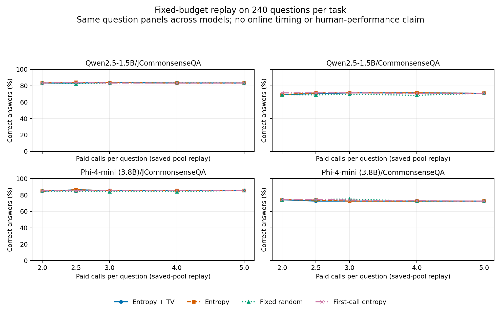

# 非Qwen系列・英語を含む固定追試

日本語JCommonsenseQAと英語CommonsenseQA各240問、Qwen2.5-1.5BとPhi-4-miniの2系列、各5つの固定された表示順。合計480問を両モデルで共有し、4,800回の実測推論を行った。960個のmodel-item観測を960問の独立標本とは数えない。

これは既存の日本語Qwen結果を知った後に設計した別の追試である。質問・モデル・プロンプト・分析・予算は新しいベンチマーク推論前に固定した。外部機関での事前登録ではなく、既知の公開validationデータであり、事前学習での未見性は保証されない。日本語と英語は異なるデータセットなので言語の因果効果を測る設計ではない。

**結論：今回の4条件でも、表示順の変化量TVを足す便益は確認できなかった。** AP差の点推定はすべて負で、主予算720回ではTV追加・entropy単独の正誤が各問で一致した。主層Phi-Englishでは固定randomが180/240、初回entropyが177/240に対し両pair方式は174/240だった。これはこの標本・予算での記述的な結果であり、randomの一般的な優位や方式間の母集団同等性は主張しない。

## 主比較：二回平均の誤答を見つける

対象は2回の候補分布平均から選んだラベルの誤り。平均分布の正規化エントロピーだけの場合と、エントロピー・表示順変更時のtotal variationの層内midrankを等重み平均した場合を比較する。双方に2回の推論が必要。主層は事前固定したPhi-Englishで、他の3層は副次的な適用範囲の確認。

| モデル / 課題 | 誤答数 | entropy AP | +TV AP | AP差 [95%区間] |
|---|---:|---:|---:|---:|
| Qwen2.5-1.5B / JCommonsenseQA | 40/240 | 0.405 | 0.357 | -0.048 [-0.151, 0.039] |
| Qwen2.5-1.5B / CommonsenseQA | 74/240 | 0.421 | 0.389 | -0.032 [-0.082, 0.022] |
| Phi-4-mini (3.8B) / JCommonsenseQA | 37/240 | 0.558 | 0.491 | -0.067 [-0.141, 0.014] |
| Phi-4-mini (3.8B) / CommonsenseQA | 62/240 | 0.513 | 0.461 | -0.051 [-0.119, 0.013] |

## 主予算：720回での正答数

pair方式は全240問に2回、優先する80問に残り3回を支払い、計720回。選択には正解や後続3回の応答を使わない。first-entropy方式も同じ総予算で、初回のみか5回平均かを選ぶ。保存した5回分の実測poolからの一括配分replayで、オンラインの運用速度や因果的な高速化ではない。

| モデル / 課題 | entropy+TV | entropy | fixed random | first entropy | 主差 pp [95%区間] |
|---|---:|---:|---:|---:|---:|
| Qwen2.5-1.5B / JCommonsenseQA | 201/240 | 201/240 | 200/240 | 200/240 | 0.000 [0.000, 0.000] |
| Qwen2.5-1.5B / CommonsenseQA | 171/240 | 171/240 | 167/240 | 171/240 | 0.000 [0.000, 0.000] |
| Phi-4-mini (3.8B) / JCommonsenseQA | 205/240 | 205/240 | 202/240 | 205/240 | 0.000 [0.000, 0.000] |
| Phi-4-mini (3.8B) / CommonsenseQA | 174/240 | 174/240 | 180/240 | 177/240 | 0.000 [0.000, 0.000] |

## 全予算の結果

全パネルは同じ0–100%軸。線は保存した推論poolからの記述的な再配分結果で、オンライン速度ではない。

| モデル / 課題 | calls/item | entropy+TV | entropy | random | first entropy |
|---|---:|---:|---:|---:|---:|
| qwen2.5-1.5b/JCommonsenseQA | 2 | 200/240 | 200/240 | 200/240 | 200/240 |
| qwen2.5-1.5b/JCommonsenseQA | 2.5 | 200/240 | 202/240 | 198/240 | 201/240 |
| qwen2.5-1.5b/JCommonsenseQA | 3 | 201/240 | 201/240 | 200/240 | 200/240 |
| qwen2.5-1.5b/JCommonsenseQA | 4 | 200/240 | 200/240 | 201/240 | 200/240 |
| qwen2.5-1.5b/JCommonsenseQA | 5 | 200/240 | 200/240 | 200/240 | 200/240 |
| qwen2.5-1.5b/CommonsenseQA | 2 | 166/240 | 166/240 | 166/240 | 171/240 |
| qwen2.5-1.5b/CommonsenseQA | 2.5 | 169/240 | 171/240 | 165/240 | 171/240 |
| qwen2.5-1.5b/CommonsenseQA | 3 | 171/240 | 171/240 | 167/240 | 171/240 |
| qwen2.5-1.5b/CommonsenseQA | 4 | 171/240 | 171/240 | 164/240 | 170/240 |
| qwen2.5-1.5b/CommonsenseQA | 5 | 170/240 | 170/240 | 170/240 | 170/240 |
| phi-4-mini/JCommonsenseQA | 2 | 203/240 | 203/240 | 203/240 | 204/240 |
| phi-4-mini/JCommonsenseQA | 2.5 | 207/240 | 207/240 | 203/240 | 204/240 |
| phi-4-mini/JCommonsenseQA | 3 | 205/240 | 205/240 | 202/240 | 205/240 |
| phi-4-mini/JCommonsenseQA | 4 | 205/240 | 205/240 | 202/240 | 205/240 |
| phi-4-mini/JCommonsenseQA | 5 | 205/240 | 205/240 | 205/240 | 205/240 |
| phi-4-mini/CommonsenseQA | 2 | 178/240 | 178/240 | 178/240 | 179/240 |
| phi-4-mini/CommonsenseQA | 2.5 | 174/240 | 177/240 | 179/240 | 179/240 |
| phi-4-mini/CommonsenseQA | 3 | 174/240 | 174/240 | 180/240 | 177/240 |
| phi-4-mini/CommonsenseQA | 4 | 174/240 | 174/240 | 174/240 | 175/240 |
| phi-4-mini/CommonsenseQA | 5 | 174/240 | 174/240 | 174/240 | 174/240 |

## 保持した失敗と実行系

最初のv1はPhiの合成24回だけで停止し、評価問題には0回。初回の失敗詳細は保存されず、別の合成48回で再調査した。この後続診断では、省略した最終位置headと全位置headの確率差が、既存の1e-5許容値を12合成ケース中2ケースで超えた。全ラベルは一致し、最大確率差は1.279e-5。全位置headの繰り返しでは12ケースとも差0。行列形状に伴う丸め差は仮説で、因果的な原因分離ではない。

v1と診断を残し、新しいv2で両モデルをstock full-position head（logits_to_keep=0）へ統一した。float32/MPS/eager、候補集合、質問、閾値、分析は変更していない。v2の26回の英日繰り返し検査と2回のwarm-upを各モデルで除外。全記録の呼び出し数は4,800 measured +24 initial failure +48 diagnostic +56 v2 checks =4,928。v2の測定失敗は0。これは省略headとの等価性証明ではない。

## 再計算と限界

全8スコア、2つの誤りtarget、4政策×5予算をRESULTS.jsonへ保持する。2,000回の対応する問題単位bootstrapで層内の観測rank・割付を固定した条件付き95%百分位区間を使う。未調整の記述的区間であり、多重比較後の勝者選択や有意性宣言ではない。undefined resamplesの数もJSONに残す。

選択・tokenizer・モデルrevision・実装hashを記録し、候補単一token境界と最大420入力tokenを確認した。候補確率は正解率に校正されていない。モデル系列に加えてパラメータ数も異なる。CommonsenseQA系の5択、1台のMacという範囲であり、独立端末・実利用者・業務効果の証拠ではない。

日本語派生資料にはJGLUEのCC BY-SA 4.0、英語CommonsenseQAはMIT、モデルは上流条件を保持する。モデル重み・問題原文は公開bundleに含めない。

このMarkdownのレンダラーと移植用replay/データ復元wrapperは推論開始後に書かれた表示・移植用コードである。分析関数とプロトコルは実測前の不変版を使い、replayは保存済み数値との一致を検証する。人間や別端末による独立再現を意味しない。

[検証記録](CHECKS.json)と[別実装による数値照合](INDEPENDENT_NUMERICAL_REVIEW.md)を同梱。AIによる計算確認であり、人による有用性評価ではない。
